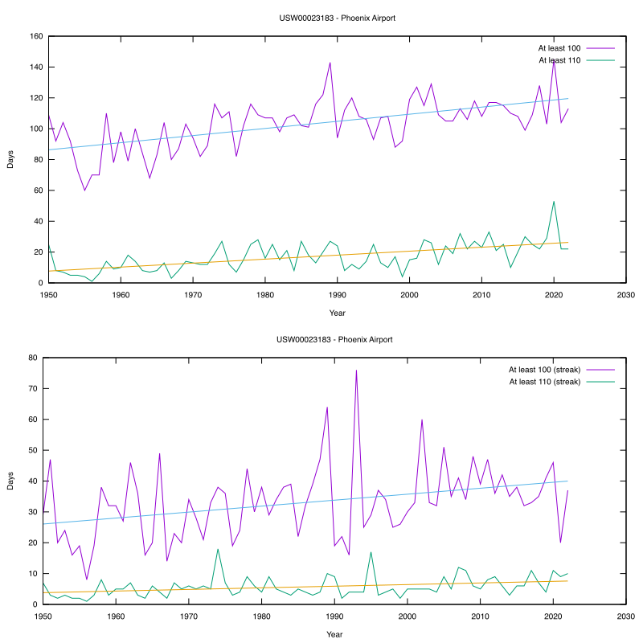

Quick and dirty script to process weather data from NOAA and make a plot of "days at least 100/110 degrees by year"

## Output



## Usage

<https://www.ncdc.noaa.gov/cdo-web/>

Request a Daily Summaries dataset for a single station.

```
php overhundred.php
gnuplot plot.p
rsvg-convert out.svg -o out.png
```
